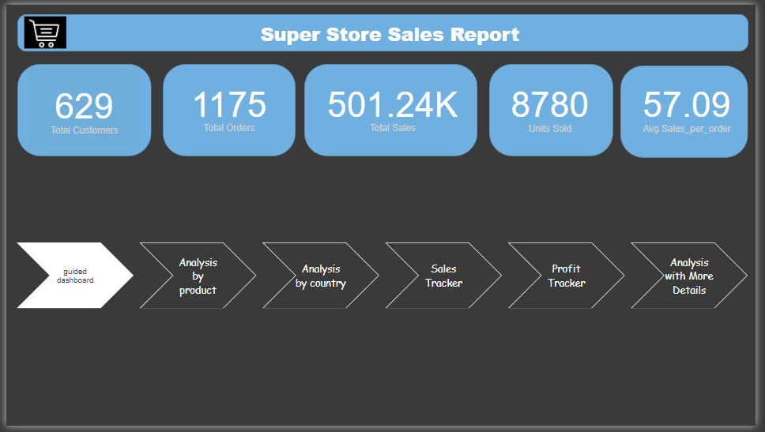
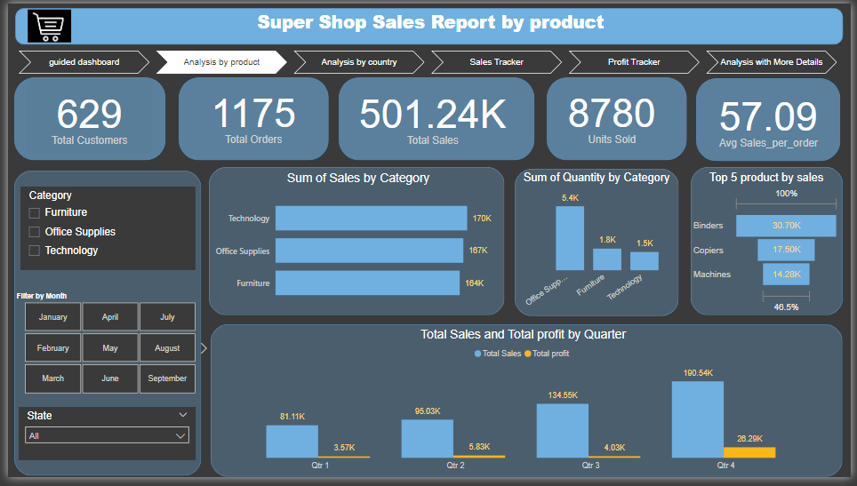
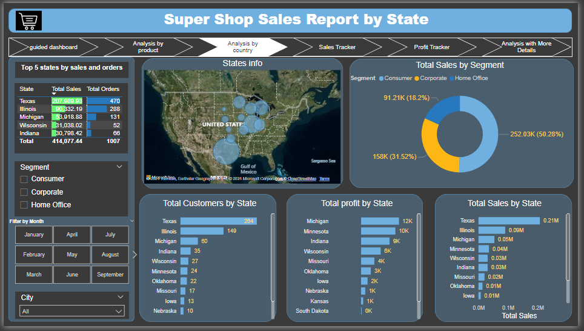
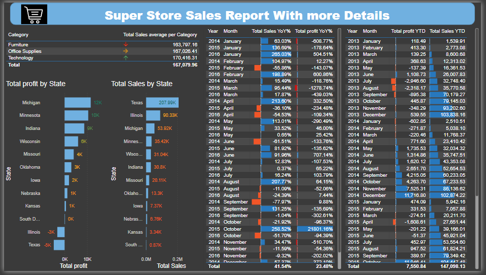
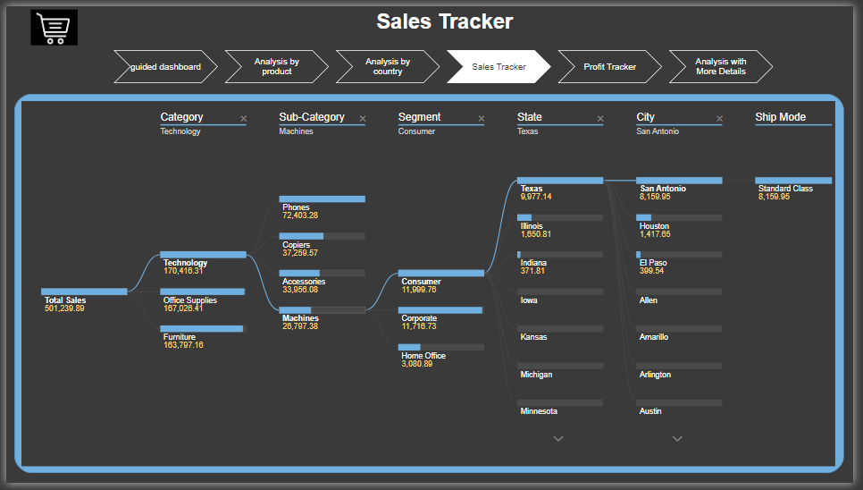
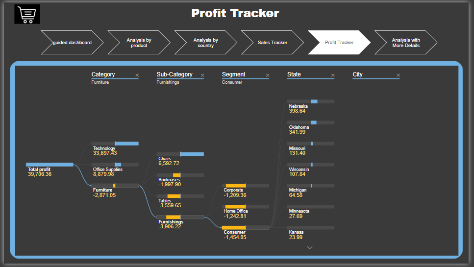
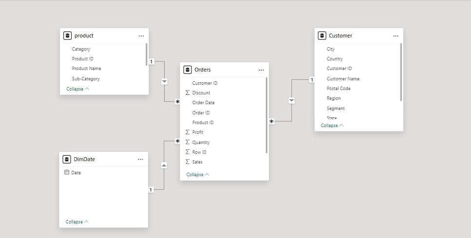
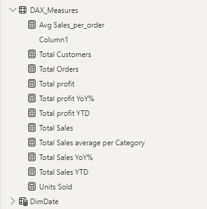

# Superstore_Analysis_Project
This project focuses on analyzing data for a superstore using Power BI, incorporating key elements of data transformation, modeling, and visualization. The goal was to generate insights into sales, customer behavior, and product performance, aiding in more informed business decisions.

# Key aspects of the project include:

* Power Query: Used for data cleaning, transformation, and preparation of raw sales data for analysis.
* Data Modeling: Built a robust data model to establish relationships between multiple data tables for efficient querying and reporting.
* DAX (Data Analysis Expressions): Applied DAX functions to perform complex calculations, create custom measures, and analyze trends within the dataset.
* Dashboard Creation: Designed an interactive dashboard that provides actionable insights into key metrics like sales performance, customer segments, product profitability, and regional analysis.
The final dashboard offers a comprehensive view of superstore operations, enabling stakeholders to monitor performance, track KPIs, and identify areas for improvement.

